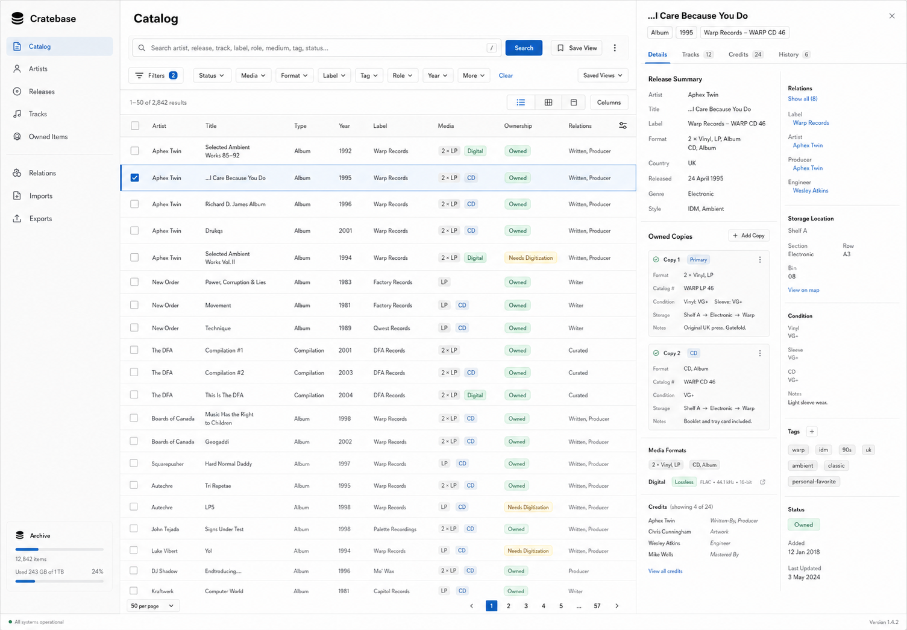
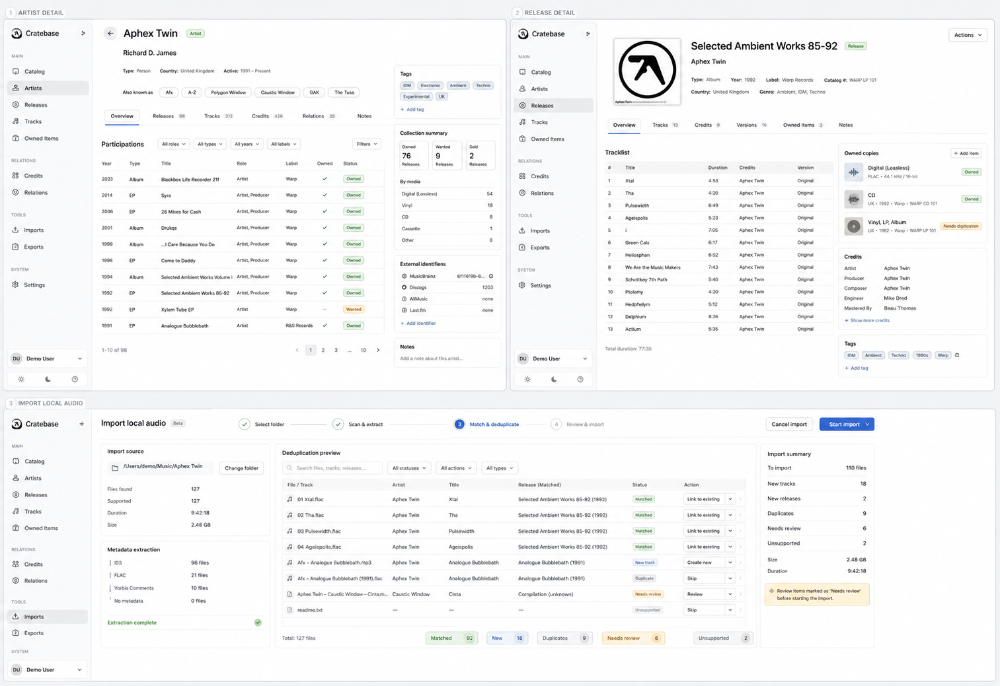

# DiscWeave

<p align="center">
  
</p>

DiscWeave is a personal music knowledge base and collection inventory for
collectors, DJs, music bloggers, journalists, and deep music nerds.

It helps answer one question: **what do I have in my collection, and how is it
connected?**

DiscWeave is an archive, not a music player. It focuses on releases, tracks,
artists, labels, credits, roles, aliases, versions, physical and digital copies,
local files, imports, search, and portable exports.

## What DiscWeave Does

- Catalog releases, tracks, media, labels, artists, and owned copies.
- Keep reference release data separate from concrete user-owned items.
- Model credits, roles, aliases, memberships, remixes, versions, and label
  relationships.
- Edit genres, user tags, and local file tag metadata without treating tags as
  streaming-library state.
- Configure collection dictionaries, relation types, tag role mappings, naming
  profiles, and track relation parser rules.
- Suggest track-version links during import review, then create accepted
  relations such as edits, remixes, and alternate versions automatically.
- Track physical and digital collection coverage, condition, storage, local file
  paths, and gaps.
- Import local folders and Discogs-assisted metadata with explicit
  deduplication, relation suggestions, and review steps.
- Search across music entities, ownership state, credits, formats, tags, and
  relationships.
- Export collection data in human-readable formats.

## Screenshots

| Catalog search and detail                                                  | Import review board                                                    |
| -------------------------------------------------------------------------- | ---------------------------------------------------------------------- |
|  |  |

## Current Product

DiscWeave is a local-first open-source macOS desktop product. The desktop app
owns a local API sidecar and stores the user's archive on the machine.

- Electron and React for the app shell and UI.
- A local ASP.NET Core API sidecar for domain logic, import, export, and search.
- SQLite and local artifact directories under macOS Application Support.
- A local owner session with one default collection.
- Apple Silicon signed and notarized DMG releases through GitHub Releases.

## Repository Layout

- `api/` - ASP.NET Core API, domain model, persistence, import, export, search,
  and tests.
- `app/` - React/Vite UI and Electron desktop shell.
- `.github/` - monorepo issue and pull request templates.
- `docs/` - root-level product, release, brand, and contributor documentation.

## Local Development

API:

```sh
cd api
dotnet restore DiscWeave.slnx
dotnet build DiscWeave.slnx --configuration Release
```

App:

```sh
cd app
npm ci
npm run typecheck
npm test
npm run build
```

Desktop-local runtime, SQLite storage, backend lifecycle, unified CI, and DMG
release automation are documented in `app/docs/`, `api/docs/`, `docs/releases/`,
and `.github/workflows/`.

## Brand

DiscWeave uses the Woven Catalog Grid mark: record grooves, index-card
structure, and relationship lines in one calm archive symbol.

See `docs/brand/identity.md` for usage rules and GitHub social preview source
artwork.

## Roadmap

The canonical roadmap is the GitHub Project:

https://github.com/users/Fredoq/projects/2

Use the `Sequence` field as the intended implementation order. The active
release is `v2-local-first-desktop`.

## Community and Security

- See `CONTRIBUTING.md` for setup, scope, and pull request expectations.
- See `SECURITY.md` for private vulnerability reporting and local data handling.
- See `CODE_OF_CONDUCT.md` for participation expectations.
